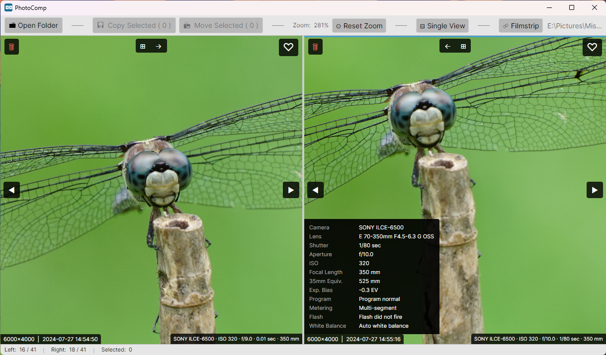
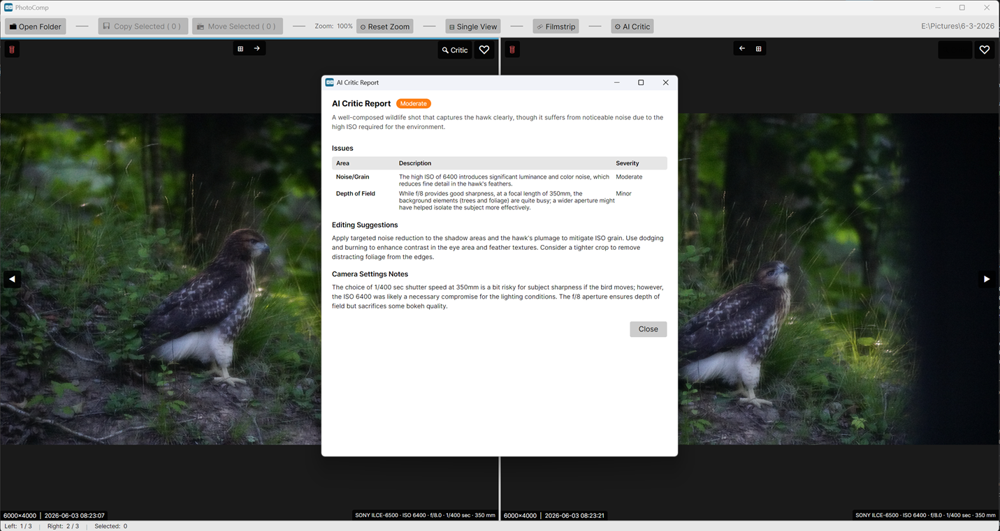

# PhotoComp



A desktop photo comparison tool for Windows and Linux. Open a folder of images and compare them side-by-side with synchronized zoom and pan. Mark favorites with a heart, then copy them — along with any sidecar files — to a destination folder. Delete unwanted images directly from the app, including their RAW originals and metadata sidecar files.

## Uses

This tool is useful for both AI-generated images and camera photos.

For photos, the single-view is helpful for zooming in on details and removing photos that are too blurry to work with. The corresponding RAW file (if existing) will also be removed. Also, the favorites tagging feature allows you to select the best images out of a folder; copying to another working folder, you can then edit further or send off for printing.

### For AI art, the dual-pane feature allows comparisons to pick the best out of multiple revisions of the same image. A lot of intermediate working images can get created; tagging with the favorites feature allows just the best or final versions to be copied to a another folder for safe-keeping.

## Features

- **Side-by-side panels** — two independent image panels displayed simultaneously
- **Synchronized zoom & pan** — mouse-wheel zoom, touchpad pinch, touchscreen pinch, and drag-to-pan affect both panels at once; double-click to reset
- **Independent navigation** — each panel navigates through the image list separately using on-screen buttons or arrow keys
- **Push to other panel** — `→` / `←` buttons at the top of each panel instantly load its current image into the opposite panel
- **EXIF-sorted loading** — images are sorted by date taken (falls back to file modification time when EXIF is absent)
- **Favorite selection** — click the heart icon on any image to mark it; click again to deselect
- **Copy with sidecars** — copies selected images to a chosen folder; automatically copies matching sidecar files (RAW, XMP, JSON, TXT) alongside each image
- **Drag-and-drop opening** — drop a folder or image file onto the app to open it quickly
- **Delete with sidecars** — permanently deletes the current image and any accompanying sidecar files after confirmation
- **Single/dual view toggle** — switch between side-by-side and single-panel view from the toolbar
- **Busy indicator** — a loading overlay and wait cursor appear while a large folder is being scanned
- **Thumbnail Selector Dialog** — view all images as thumbnails for easy selection
- **AI Critic** — send the current image to a local or cloud vision LLM for artifact detection, composition feedback, prompt suggestions, and camera settings advice

---

## Requirements

- No .NET install required — the zip already bundles the .NET 10 runtime alongside the app

---

## EZ Install

Download the latest release from the [Releases page](https://github.com/AvidGameFan/PhotoComp/releases).

Most Windows users should grab **`PhotoComp-windows-x64-vX.Y.Z.zip`**. Extract the zip into a folder and run `PhotoComp.exe` — no installer needed.

Linux users should grab **`PhotoComp-linux-x64-vX.Y.Z.zip`**, extract it, and run:

```bash
chmod +x PhotoComp
./PhotoComp
```

---

## Expert Install

### From the zip

The zip contains a folder of files — the app and the bundled .NET 10 runtime. There is no single-file executable; just extract the zip and run the binary inside.

**Windows** — extract `PhotoComp-windows-x64-vX.Y.Z.zip`, then:

```
PhotoComp.exe
```
An ARM version is also available, for those using Qualcomm tablets and laptops running Windows.

**Linux** — extract `PhotoComp-linux-x64-vX.Y.Z.zip`, then:

```bash
chmod +x PhotoComp
./PhotoComp
```

### From source

```bash
git clone https://github.com/your-org/PhotoComp.git
cd PhotoComp
dotnet run --project PhotoComp/PhotoComp.csproj
```

---

## Usage

### Opening images

Click **📁 Open Folder** in the toolbar and choose a folder containing JPEG or PNG images. Images are loaded in EXIF date order (oldest first). The left panel starts at the first image and the right panel starts at the second. You can also drag and drop a folder onto the window, or drop a single image file to open its folder and jump to that image.

### Navigating

| Action | Result |
|--------|--------|
| Click **◄** / **►** buttons | Move to previous / next image in that panel |
| Click a panel, then **← →** arrow keys | Keyboard navigation for the focused panel |
| Click **→** (top of left panel) | Load the left panel's current image into the right panel |
| Click **←** (top of right panel) | Load the right panel's current image into the left panel |

### Zooming and panning

| Action | Result |
|--------|--------|
| Mouse wheel or touchpad pinch | Zoom in / out (both panels, 0.1× – 10×) |
| Touchscreen two-finger pinch | Zoom in / out on touch displays |
| Left-drag | Pan the image (both panels move together) |
| Double-click | Reset zoom and pan to defaults, or zoom to pixel-level (toggle)|
| **⊙ Reset Zoom** button |  Reset zoom to 100% |

The current zoom level is shown in the toolbar as a percentage.

### Selecting images

Click the **♡** heart icon in the top-right corner of a panel to mark the current image as a favorite. A filled red **♥** indicates it is selected. Click again to deselect. The toolbar shows the running count: **💾 Copy Selected (N)**.

### Copying selected images

1.  Heart one or more images.
2.  Click **💾 Copy Selected (N)** in the toolbar.
3.  Choose a destination folder.
4.  A summary dialog reports how many files were copied, how many were skipped (already present), and details of any errors.

For each image copied, PhotoComp also copies any matching sidecar files from the same source folder — RAW originals (`.arw`, `.cr2`, `.cr3`, `.nef`, `.raf`, `.rw2`, and [many more](#sidecar-formats)), XMP metadata (`.xmp`), and plain-text companions (`.json`, `.txt`). For example, `IMG_1234.jpg` will carry over `IMG_1234.arw` and `IMG_1234.xmp` if they exist. Originals are never modified or overwritten.

### Deleting images

Press **Del** on the keyboard (or use the delete button in the panel) to permanently delete the current image. A confirmation dialog lists the image and any sidecar files that will also be removed. Deletion cannot be undone.

### Single-panel view

Click **⊟ Single View** in the toolbar to hide the right panel and give the left panel the full window width. Click **⊞ Dual View** to restore the side-by-side layout.

### Info overlay

Each panel shows a small overlay in the bottom-left corner with the image's pixel dimensions and EXIF date/time:

```
3024×4032  |  2024-06-15 14:32:07
```

The bottom-right corner displays camera EXIF info for photos, or embedded prompt info for AI generated images.

---

## AI Critic

PhotoComp can send the currently displayed image to a vision-capable LLM for analysis and return tailored feedback directly in the app.



### Setup

1. Click **⚙ AI Critic** in the toolbar.
2. Fill in the three fields and click **Save**:

| Field | Description |
|-------|-------------|
| **API Base URL** | Base address of any OpenAI-compatible server — e.g. `http://localhost:11434` (Ollama), `http://localhost:1234` (LM Studio), `https://api.openai.com` (OpenAI) |
| **API Key** | Authorization key (Bearer token). Leave blank for local servers that don't require authentication. |
| **Model Name** | A vision-capable model, e.g. `llava`, `gemma3`, `gpt-4o`, `moondream`. The model **must** support image input. (Can leave blank for LM Studio.) |

Settings are saved to `%AppData%\PhotoComp\settings.json` and restored on next launch.

> If leaving Model Name blank for LM Studio, you still need to manually load the model within LM Studio.  A "vision" model is required, which usually requires a separate mmproj file to be copied into the LLM's model folder (in addition to the model itself).

### Running a critique

Click the **🔍 Critic** button in the top-right overlay of either panel. The report dialog opens immediately and shows "Analyzing image…" while the model works (allow up to ~2 minutes).

PhotoComp automatically detects the image type and chooses the appropriate prompt:

**For AI-generated images** (images that contain embedded Stable Diffusion or similar metadata):
- Checks for common generation artifacts: extra fingers, facial anomalies, anatomy errors, melting objects, garbled text, lighting inconsistencies, etc.
- Reports issues with a severity rating (Minor / Moderate / Severe)
- Suggests terms to **add to the positive prompt** and **negative prompt**
- Recommends changes to CFG scale, sampler, steps, or other parameters

**For photographs** (images with EXIF camera data, or no AI metadata):
- Critiques composition, exposure, focus, lighting, colour, and noise
- Considers the actual EXIF values (ISO, aperture, shutter speed, focal length) when commenting on settings choices
- Suggests specific **editing improvements** such as cropping, straightening, dodging/burning, and colour grading
- Notes whether camera settings were well-matched to the scene

Images larger than 2 megapixels are automatically downscaled before being sent to keep request size reasonable.

---

## Building

The default version number is read from `version.txt` in the repository root. Edit that file to change it project-wide, or pass `-Version` / a positional argument to override for a single build.

### Windows x64 (produces `dist\PhotoComp-windows-x64-vX.Y.Z.zip`)

```powershell
.\run-build-windows.bat
.\run-build-windows.bat 1.2.0
```

### Windows ARM64 (produces `dist\PhotoComp-windows-arm64-vX.Y.Z.zip`)

```powershell
.\run-build-windows-arm64.bat
.\run-build-windows-arm64.bat 1.2.0
```

### Linux x64 from Windows (cross-compile, produces `dist\PhotoComp-linux-x64-vX.Y.Z.zip`)

```powershell
.\run-build-linux.bat
```

### Linux natively (produces `dist/PhotoComp-linux-x64-vX.Y.Z.zip`)

```bash
chmod +x build-linux.sh
./build-linux.sh
```

> **Note:** The Linux zip is built without execute-bit preservation. Recipients may need to run `chmod +x PhotoComp` once after extracting.

---

## Running Tests

```bash
dotnet test PhotoComp.Tests/PhotoComp.Tests.csproj
```

---

## Supported Formats

### Viewable images


| Format | Extension     |
|--------|---------------|
| JPEG | `.jpg`, `.jpeg` |
| PNG  | `.png`          |

### Sidecar formats

When copying or deleting, PhotoComp also handles any matching sidecar file with the same base name:

| Category | Extensions |
|----------|------------|
| XMP metadata | `.xmp` |
| Plain text | `.json`, `.txt` |
| Canon RAW | `.cr2`, `.cr3` |
| Nikon RAW | `.nef`, `.nrw` |
| Sony RAW | `.arw` |
| Fujifilm RAW | `.raf` |
| Panasonic / Leica RAW | `.rw2`, `.raw`, `.rwl` |
| Olympus / OM System RAW | `.orf` |
| Pentax RAW / DNG | `.pef`, `.dng` |
| Hasselblad RAW | `.3fr`, `.fff` |
| Phase One / Mamiya RAW | `.iiq`, `.mef` |
| Sigma RAW | `.x3f` |
| Minolta RAW | `.mrw` |
| Samsung RAW | `.srw` |
| Kodak RAW | `.kdc`, `.dcr` |
| Epson RAW | `.erf` |

RAW files are not rendered as viewable images — only JPEG and PNG are displayed in the panels.

---

## License

MIT

---

## Discussion

Initial version mostly coded by Claude Sonnet 4.5 and 4.6, with design, guidance, and testing by Avidgamefan.